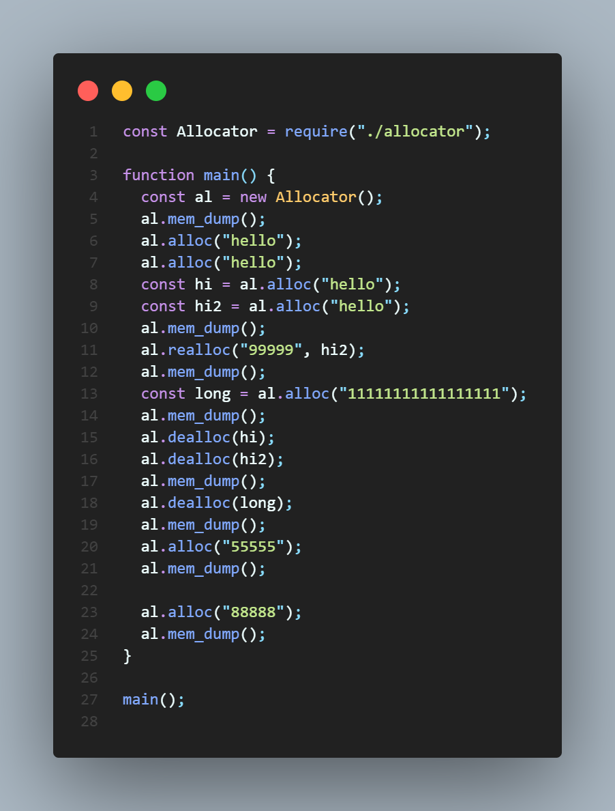
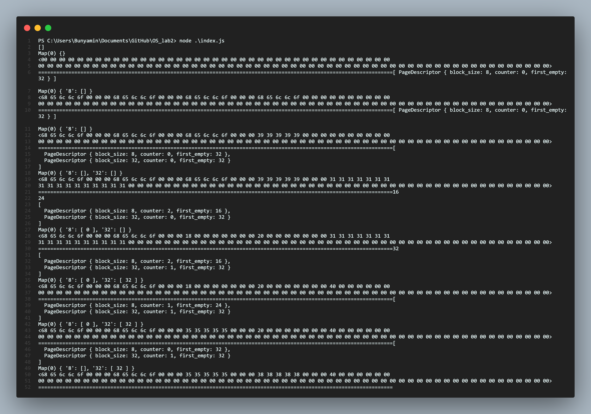

# OS_lab2

This lab is about memory allocation using pages.

## Common algorithm

Firstly, the allocator divides the whole provided memory into pages. All the pages have the same size and the size is the power of two. Also the amount of pages is specified when allocator is initialized.
Every page is also divided into equal sized blocks(also the power of two).
Blocks are of 2 types:

- smaller than half of page;
- bigger than half of page;

The instance of allocator has next fields:

- the memmory itself, represented by Buffer in Node.js;
- array of Descriptors for every page;
- Map(or list) of all pages, which have at least one free block.

## Methods description

### `mem_dump()`

Prints out current states of Buffer, Descriptors array and Map.

### `alloc(value: string)`

This method allocates new memory(or string). It follows the next logical tree.

- If the string is bigger than half of page:
  - If the string is bigger than a page size:
    - Create needed amount of pages, assign value to the pages, mark those pages as taken.
  - Else:
    - create new page and assign it entirely to new block;
- Else:
  - if there is a page of appropriate size of block:
    - put the string into that page;
  - else: - create new page of needed block size and put the block here;

### `realloc(index: number, value: string)`

Finds the block, which refers to start index. If the value size is less or equal to the size of the block, then we clear/replace it. Else we ignore that opeation.

### `dealloc(index: number)`

Finds the block, which refers to start index. Clears the block, adds necessary info it to the page Descritors and to Map of empty blocks.

## Example

The provided code in `index.js` file is quite a thorough example, but here is the same code in screenshots with the result of work.

