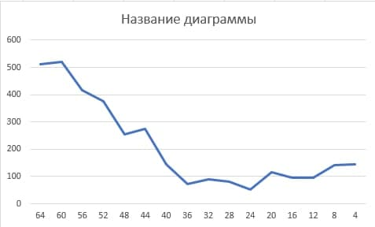

# OS_lab3

This lab is about task management in Operating Systems.
The lab variant is 1, which means that FIFO with priorities without crowding out is implemented.

This lab is implemented in Node.js and this solution has it's consequences and problems, which will be covered later in this doc.

## The algorithm

The algorithm FIFO is very easy. In our project it is imlemented using JavaScript classes and array. It has 4 methods:

- insert(value: any, priority: number);
- getHighestPriority();
- deleteHighestPriority();
- #sortQueue();

The `insert` method is used by `Task Manager`class, while other methods are used by `CPU` class.

Now let's look at the implementation of task management.
We have two classes:

- CPU
  - async work(interval: number);
- TaskGenerator
  - generate(number: number);

So, both classes share the same Priority Queue.
Firstly, we initialize TaskGenerator object. Then we call `generate` method, which creates certain amount of tasks. Each task is imlemented by Task class, which has `id` field, and `runAndFinish` field, which stands for async function, imitating some work.
When queue is ready, we create a CPU object, passing the queue to it's constructor.
Finally, we call `CPU.work(number)` so that our CPU gets task by task from queue with max interval. That means that we won't be able to get task earlier, than certain time.

## How should it have worked

In _normal_ programming languages, which have streams/threads or co/go-routines, we would be able to make it following next instructions:

1. The queue is created.
2. Task Generator is created and placed to one thread.
3. CPU is created and placed to another thread.
4. `Task_Generator.generate` and `CPU.work` are called and work in two threads in parallel endlessly.

This would give us the ability to propperly imitate and benchmark how task manager works with CPU and also to create propper diagrams.

## How it works in Node.js

Node.js can provide 3 types of work:

- sync execution
- async execution
- worker thread.

The first type is implemented in this work. Both second and third types are easy to implement, but it will still be unfinished and here is why.

## Why can't we do it propperly

Let's first look at async execution. The problem here is that if we make endless task generator, then the event loop will be stuck on this endless loop. So it will never finish doing maing task to switch to secondary task. More about event loop here. Even if we make execution of async generator one by one, it will not reflect the true work of CPU with Task Manager. The CPU in this situation will take task for execution every time task generator pushes a new task. In this case there won't be any need in a queue, so the our lab fails.
The second approach is worker threads. If we try to make endless loop we are stuck again with node process not finishing the infinite loop(which sound normal if we remember, that Node.js is single-threaded). However, we can make two worker threads talk to each other by event emitting and triggering. The problem is: when should we emmit an event? The only time is when we insert something to the queue, but this solution has no difference with the solution in previous paragraph. So worker threads will not work also.

What will works, is creating a Pool of tasks instead of queue of tasks, but it is not the topic of current work.

## Diagrams

Considering earlier facts the only thing we could measure in this work is dependence of wait time from queue intensity and it has next view.

For other measurements we will need to switch to another programming language and to use real threads.
