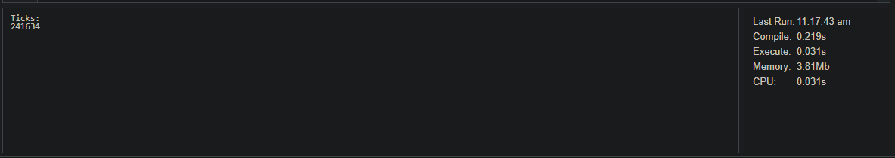

# Lab 5-6

## Lab 5

Lab 5 was written in C#. To run the code [dotnetfiddle](https://dotnetfiddle.net/#) was used.
So, before optimizing the program had following results:

After optimizing it has following results:

In order to optimize the program following steps were done:

- replace `[j][i]` to `[i][j]`
- change array type to `byte[]` so it takes less memory than `int[]`

## Lab 6

Lab 6 was given in C++ language, but in order to run profiling it was _translated_ to Node.js. So, the results of profiling are:

As we can see, it gave us 0 confidence in what we need to do, so just usual optimization was made. Removed unnecessary and senseless code blocks(loops, if statements).
